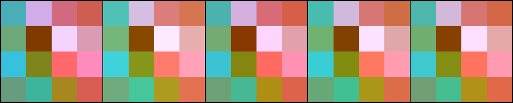
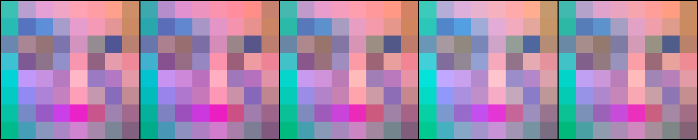
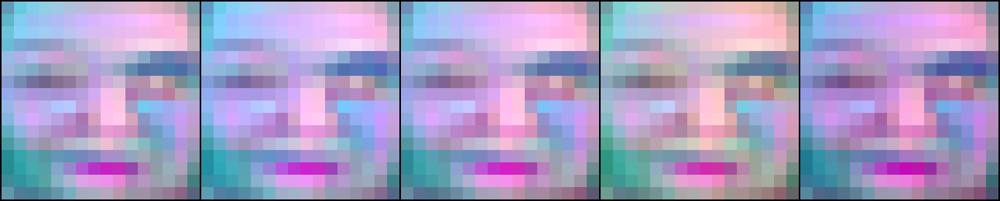
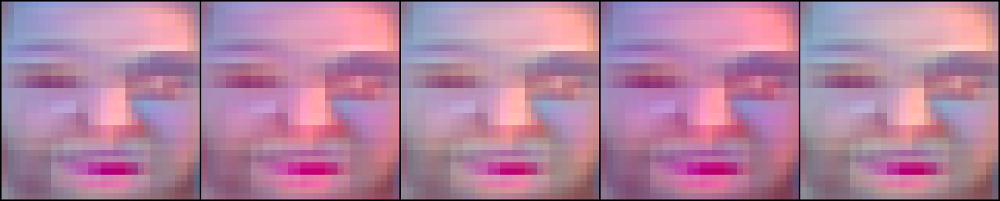
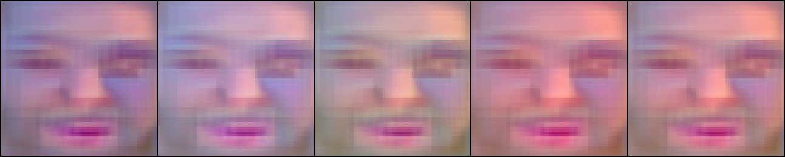
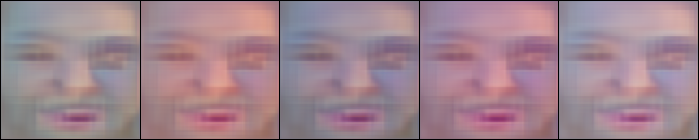
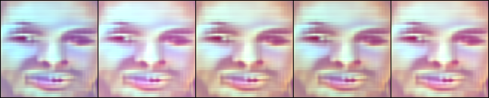
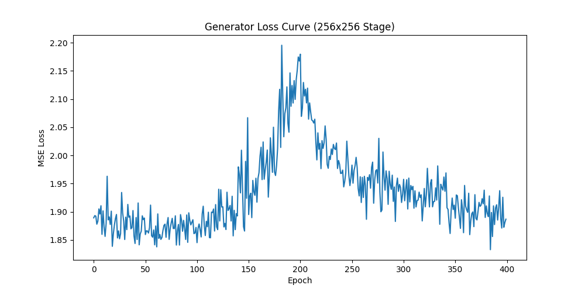

# PoC: DINO-Guided Face Generator

This repository contains a Proof of Concept (PoC) for an image generation model that uses a progressive, coarse-to-fine strategy guided by DINOv2 patch embeddings. The goal is to validate a novel architecture that could lead to faster and more semantically controllable image synthesis compared to traditional diffusion models.

## PoC Goals

The primary objective is to build and train a model that can generate 256x256 pixel images of human faces. The core hypothesis is that a progressive generator can be trained to produce coherent images using multi-scale DINOv2 patch embeddings as its primary loss function, bypassing the need for a traditional GAN discriminator.

## Getting Started

### System Requirements
- Python 3.11
- A virtual environment manager like `venv`.

### Setup
1. **Create and activate a virtual environment:**
   ```bash
   python3.11 -m venv .venv
   source .venv/bin/activate
   ```
2. **Install dependencies:**
   ```bash
   pip install -r requirements.txt
   ```

### Preparing Your Data
The data preparation process is now split into two steps: downloading (optional) and cropping.

#### Step 1: Downloading Images (Optional)
If you need to download a sample dataset, you can use the `download_images.py` script.
   ```bash
   source .venv/bin/activate
   python scripts/download_images.py
   ```
This will download the 5 sample images into the `data/downloads/` directory.

#### Step 2: Cropping Faces
This step processes all images in a source directory, detects faces, and saves the cropped 256x256 results to `data/raw_images/`.

To process the downloaded sample images, run:
   ```bash
   source .venv/bin/activate
   python scripts/prepare_test_images.py
   ```
To process your own local images, first place them in a directory (e.g., `my_photos/`) and then modify the `INPUT_DIR` variable in `scripts/prepare_test_images.py` to point to your directory.

### Running the Training Pipeline
Once your cropped face images are in `data/raw_images/`, you can run the entire training workflow:
   ```bash
   bash main.sh
   ```

## Project Status

The project is broken down into four key milestones. The first three milestones are now complete, validating the core hypothesis of this PoC.

*   **Milestone 1: DINOv2 Feature Pyramid Pre-computation**
    *   **Status:** ✅ Complete
    *   **Description:** A data pipeline was created to process source images, extract multi-scale DINOv2 patch embeddings (a "feature pyramid"), and save them to disk as the ground truth for the generator.
    *   **Details:** See **[docs/01-feature-pyramid.md](docs/01-feature-pyramid.md)**.

*   **Milestone 2: Foundational Model Training**
    *   **Status:** ✅ Complete
    *   **Description:** A progressive generator was trained from a 4x4 to a 32x32 resolution. This stage proved the core hypothesis that the model can learn to synthesize coherent, face-like structures using only DINO features as guidance.
    *   **Details:** See **[docs/02-foundational-model.md](docs/02-foundational-model.md)**.

*   **Milestone 3: Target Resolution Generation (256x256)**
    *   **Status:** ✅ Complete
    *   **Description:** The generator was successfully scaled to the target 256x256 resolution. To achieve photorealism and correct for color artifacts produced by the DINO-only loss, a GAN discriminator was introduced to work alongside the DINO guidance.
    *   **Details:** See **[docs/02-foundational-model.md](docs/02-foundational-model.md)**.

*   **Milestone 4: Initial Text-Conditioning (Future Work)**
    *   **Status:** 📝 Planned
    *   **Description:** The next step is to implement basic text-based control over the generated images by integrating a pre-trained CLIP text encoder.

*   **Milestone 5: Generalization Testing with FFHQ (Future Work)**
    *   **Status:** 📝 Planned
    *   **Description:** To validate the robustness of the model, the next step is to run the entire training pipeline on a larger, more diverse dataset like FFHQ.

## Progressive Results

The following table shows the final generated image from a fixed noise vector at the end of each training stage. This demonstrates the model's ability to progressively add detail and coherence as the resolution increases.

| 4x4 | 8x8 | 16x16 | 32x32 |
| :---: | :---: | :---: | :---: |
|  |  |  |  |
| **64x64** | **128x128** | **256x256** | **256x256 Loss Curve** |
|  |  |  |  |


## Project Structure

The repository is organized to ensure clarity and reproducibility:

-   `main.sh`: The main entry point to run the entire PoC workflow.
-   `scripts/`: Contains the individual Python scripts that execute each milestone of the PoC.
-   `tests/`: Contains the corresponding tests for each script to ensure correctness.
-   `data/`: The target directory for raw images and the pre-computed feature pyramids (ignored by git).
-   `docs/`: Contains all project documentation, including brainstorming, roadmapping, and detailed milestone plans.
-   `requirements.txt`: Lists all Python dependencies for the project.

## Documentation

For a deeper dive into the project's conception and technical plan, please see the following documents:

*   **[docs/brainstorming.md](docs/brainstorming.md):** The initial exploration of the coarse-to-fine generation strategy.
*   **[docs/roadmap.md](docs/roadmap.md):** A detailed, milestone-based plan for executing this Proof of Concept.
*   **[docs/01-feature-pyramid.md](docs/01-feature-pyramid.md):** The technical plan for pre-computing DINOv2 feature pyramids.
*   **[docs/02-foundational-model.md](docs/02-foundational-model.md):** The technical plan and results for training the progressive generator.
