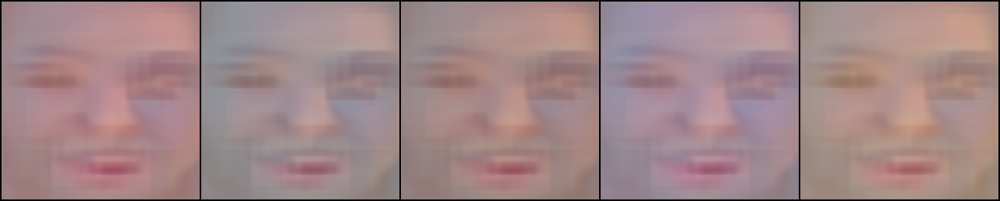

# PoC: DINO-Guided Face Generator

This repository contains a Proof of Concept (PoC) for an image generation model that uses a progressive, coarse-to-fine strategy guided by DINOv2 patch embeddings. The goal is to validate a novel architecture that could lead to faster and more semantically controllable image synthesis compared to traditional diffusion models.

## PoC Goals

The primary objective is to build and train a model that can generate 256x256 pixel images of human faces. The core hypothesis is that a progressive generator can be trained to produce coherent images using multi-scale DINOv2 patch embeddings as its primary loss function, bypassing the need for a traditional GAN discriminator.

## Getting Started

### System Requirements
- Python 3.11
- A virtual environment manager like `venv`.

### Setup
1. **Create and activate a virtual environment:**
   ```bash
   python3.11 -m venv .venv
   source .venv/bin/activate
   ```
2. **Install dependencies:**
   ```bash
   pip install -r requirements.txt
   ```

### Preparing Your Data
The data preparation process is now split into two steps: downloading (optional) and cropping.

#### Step 1: Downloading Images (Optional)
If you need to download a sample dataset, you can use the `download_images.py` script.
   ```bash
   source .venv/bin/activate
   python scripts/download_images.py
   ```
This will download the 5 sample images into the `data/downloads/` directory.

#### Step 2: Cropping Faces
This step processes all images in a source directory, detects faces, and saves the cropped 256x256 results to `data/raw_images/`.

To process the downloaded sample images, run:
   ```bash
   source .venv/bin/activate
   python scripts/prepare_test_images.py
   ```
To process your own local images, first place them in a directory (e.g., `my_photos/`) and then modify the `INPUT_DIR` variable in `scripts/prepare_test_images.py` to point to your directory.

### Running the Training Pipeline
Once your cropped face images are in `data/raw_images/`, you can run the entire training workflow:
   ```bash
   bash main.sh
   ```

## High-Level Roadmap

The project is broken down into four key milestones:

1.  **DINOv2 Feature Pyramid Pre-computation:** Create the "ground truth" dataset of multi-scale DINOv2 patch embeddings from a set of face images.
2.  **Foundational Model Training:** Train the initial, low-resolution stages of the generator to prove it can synthesize coherent structures based on DINO features.
3.  **Full-Resolution Generation:** Scale the generator to the full 256x256 resolution and verify its ability to produce visually coherent human faces.
4.  **Initial Text-Conditioning:** Implement basic text-based control using CLIP to demonstrate the model's controllability.

This PoC demonstrates a progressive generative model for creating 256x256 face images, guided by the semantic features of a frozen DINOv2 model.

### Milestone 1: Feature Pyramid Pre-computation
- **Status:** ✅ Complete
- **Description:** Implemented a data pipeline to download images, crop faces, and pre-compute DINOv2 feature pyramids at multiple scales (4x4, 8x8, 16x16). These pyramids serve as the ground truth for the generator.
- **Result:** A set of `.pt` files, one for each image, containing the multi-scale feature embeddings.

*Pyramid Visualization for a Sample Image:*


### Milestone 2: Foundational Model Training
- **Status:** ✅ Complete
- **Description:** Developed and trained a progressive generator that learns to synthesize images by matching their DINOv2 feature pyramids to the pre-computed ones. The model was trained sequentially from 4x4 up to 256x256 resolution.
- **Result:** A trained 256x256 generator model. The images below show the final output from the fixed evaluation noise vector at the end of the full training run.

*Final 256x256 Output:*


*256x256 Loss Curve:*


### Milestone 3 & 4: Full-Resolution & Text Conditioning (Future Work)
- **Status:** 📝 Planned
- **Description:** Introduce a GAN discriminator to enforce photorealism and eliminate color artifacts. Explore conditioning the generator on text prompts for controlled image synthesis.


## Project Structure

The repository is organized to ensure clarity and reproducibility:

-   `main.sh`: The main entry point to run the entire PoC workflow.
-   `scripts/`: Contains the individual Python scripts that execute each milestone of the PoC.
-   `tests/`: Contains the corresponding tests for each script to ensure correctness.
-   `data/`: The target directory for raw images and the pre-computed feature pyramids (ignored by git).
-   `docs/`: Contains all project documentation, including brainstorming, roadmapping, and detailed milestone plans.
-   `requirements.txt`: Lists all Python dependencies for the project.

## Documentation

For a deeper dive into the project's conception and technical plan, please see the following documents:

*   **[docs/brainstorming.md](docs/brainstorming.md):** The initial exploration of the coarse-to-fine generation strategy, the role of DINOv2, and the potential for text-based conditioning.
*   **[docs/roadmap.md](docs/roadmap.md):** A detailed, milestone-based plan for executing this Proof of Concept.
*   **[docs/01-feature-pyramid.md](docs/01-feature-pyramid.md):** A detailed technical plan for the first milestone, focusing on pre-computing the DINOv2 feature pyramids.
